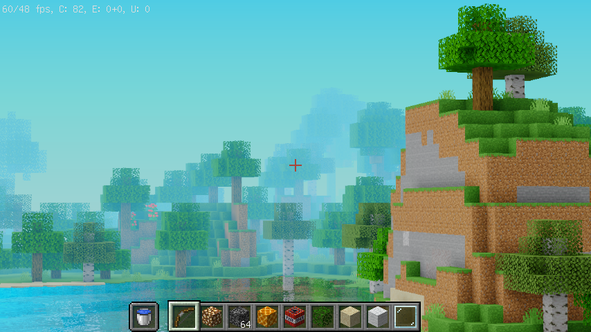
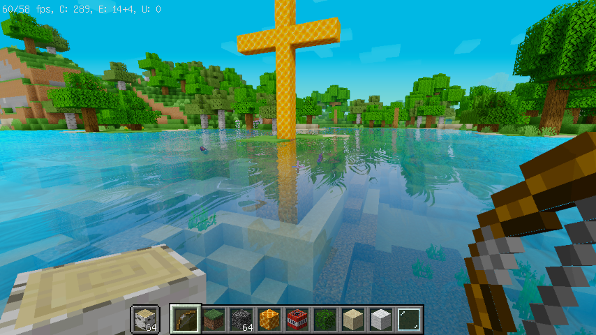
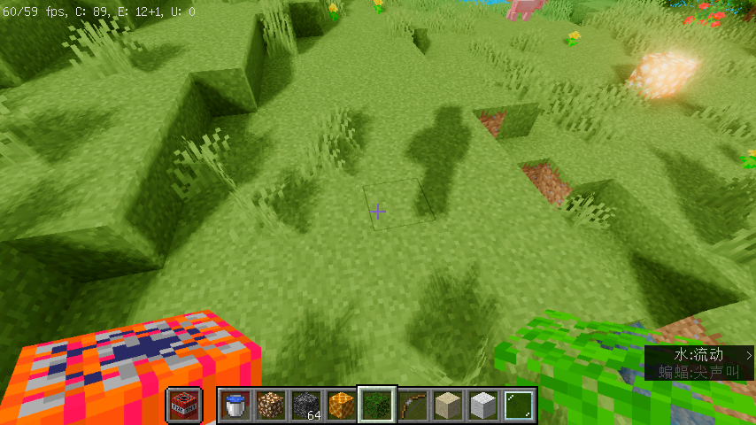
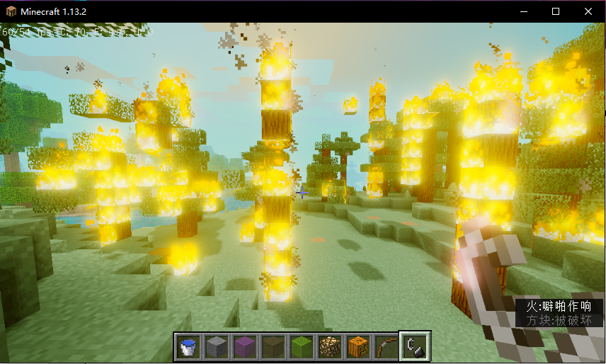

# Minecraft-shadowpack

**Minecraft-shadowpack** is a simple project about how to implement some special effect for Minecraft, which includes a series of shader files and based on [Optifine mod](https://github.com/sp614x/optifine) environment

# Features

Atmosphere and fog simulate：

Screen Space Reflection (SSR) with ray marching and Fresnel Reflection：

PCF soft shadow mapping：

Bloom with Mipmap, down sample and gauss blur：

Caustics simulate with noise texture and sine & cosine wave：

# Install it to MC

1. first u need install OptifineHD mod
2. then copy the shader package file to game directory `.minecraft/shaderpacks`
3. select it in game meun：`vedio setting --> shades`
